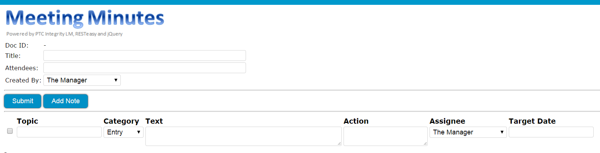
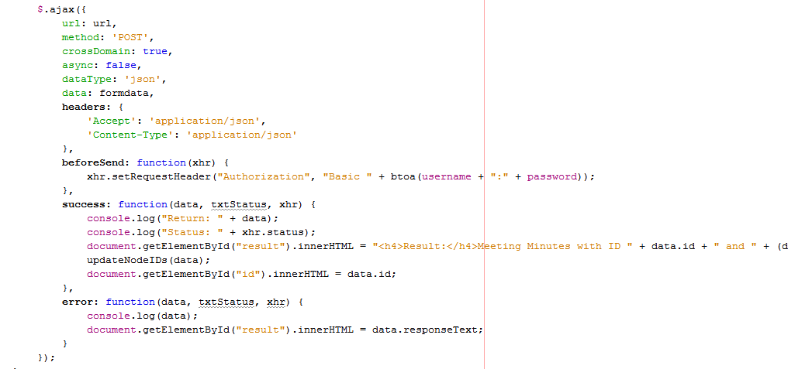
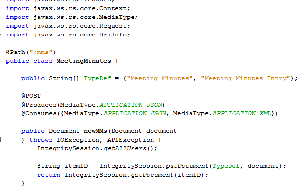
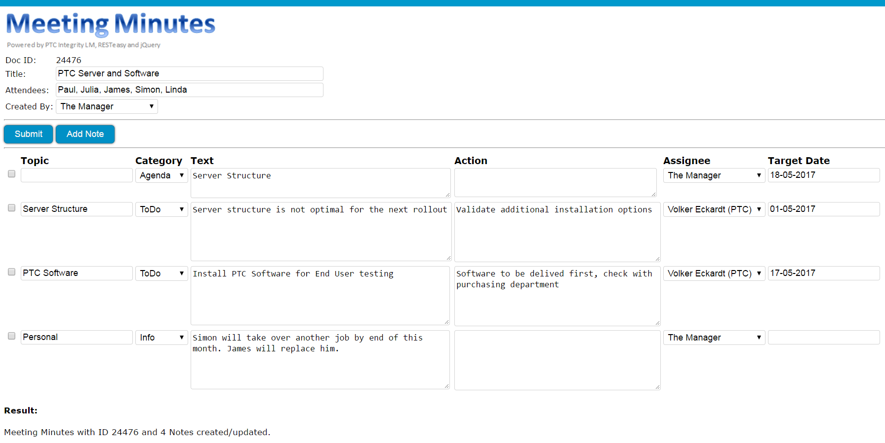
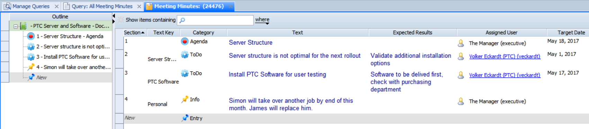

# Meeting Minutes for PTC Integrity (Demo Case only)
Demo case how to use RESTeasy together with PTC Integrity for Meeting Minutes

### How do you manage Meeting Minutes today?

If you are interested in "Meeting Minutes" and / or "RESTful services" in Integrity LM, read on ...

At PTC Consulting, we usually analyze different solution alternatives for our customers. During such an evaluation project, we analyzed the possibility of interacting with RESTful Services. As an outcome, a library was created that communicates with Integrity in order to obtain items and to create simple documents. (Since Integrity LM 10.9 and still also in 11.1 we have included RESTeasy (http://resteasy.jboss.org) as one of the well-known RESTful implementations.)

I was then looking for a good example and reminded me of my interest to go away from Excel and Word Meeting Minutes. So I implemented a simple "Meeting Minutes Application" on top of the RESTeasy libs.

I am happy to share this with interested people in the state as it is now.
 
## Please note:

- It was only created for demo purposes
- It runs on a separate Integrity project server (not on the PROD!)
- It meets the minimal requirements for a Meeting Minutes app.
- It uses RESTeasy, jQuery, and Java ServerPages
- It offers REST Basic Authentication
- It uses the server side API connection to communicate with Integrity
- It is NOT a supported PTC solution!

## Here are some details:
The Meeting Minutes form:

The JavaScript for the REST call:

The Java REST consumer:

An example after submitting the Meeting Minutes into Integrity:

 
## Installation steps (overview)

- Configure a Meeting Minutes Document in Integrity (3 Types, Categories, Fields etc.)
- Configure a User Group
- Review and install the IntegrityREST war file on server
- Review and install the MeetingMinutes war file on server.
 
## Possible Improvements

Please do not expect a feature rich implementation.
 
I can think of the following improvements:

- Dedicated login form
- Meeting Minutes overview and serach capabilities
- Load of existing Meeting Minutes into this form
- New Fields "State" and "Description" on Header, "State" on node
- New Pick list for the target project.
- New Multi Pick List for the attendees
- Automatic e-mails to the attendees when state changed to "Delivered" (Integrity Trigger)
- Automatic task creation when category is task (Integrity Trigger)
- Automatic PDF generation on server
- Additional Comments for each node
- etc etc.
 
If you are interested in the implementation of such features and want to contribute, please also let me know.
 
##  Development environment
- PTC Integrity LM 10.9 (also 11.0 should be fine)
- Netbeans 7.4 (or 8)
- Java 1.7 (or 1.8)
- to be able to deploy directly into Integrity Server, I have installed a 5.4 JBoss server locally (Integrity uses an older one), and configured NetBeans with that once

## To check
- MeetingMinutes.js for login
- MeetingMinutes.js for REST server call (server name)

## Deployment
- the netbeans configuration section will automatically copy the "war" to my local server for testing
- if you don't have a local server, then copy the "war" into the server's \server\mks\deploy directory manually

## Package / File overview
- MeetingMinutes.jsp - main file
- MeetingMinutes.js - related JavaScript
- MeetingOverview.jsp - under Construction
- css/MeetingMinutes.css - related css file 
- js/ - jQuery and Converter Files
- images - some images
- com.ptc.service.mms - helper files
- com.ptc.service.mms.api - Integrity Server Connection (to get the pick list values the easy way)

## Autorization
- Is the "Basic"
- OAuth2 was also considered but is not implemented yet

## Tested with
- Chrome
- Firefox

## Inside the files
- you will see some references to web pages that I have used as input
